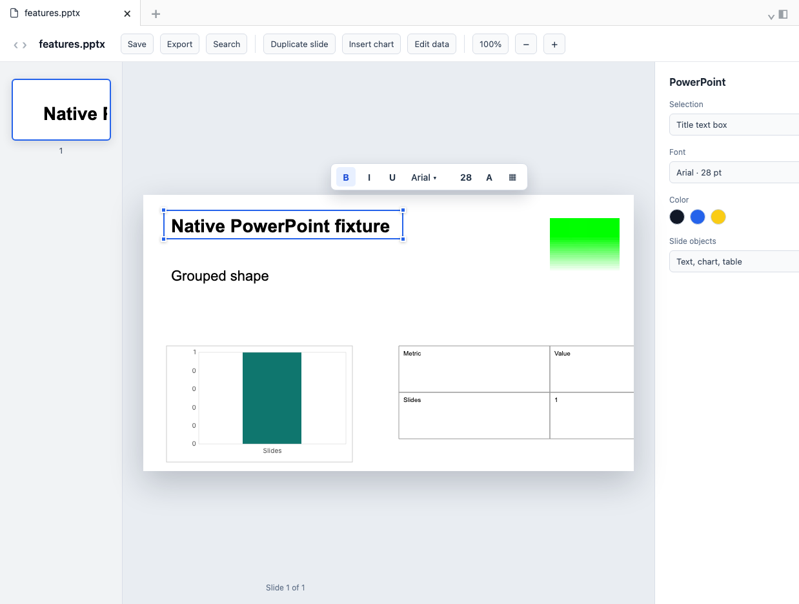

# Native PowerPoint Doc Editor

Native PowerPoint Doc Editor is an Obsidian plugin for opening, searching, and editing `.docx` and `.pptx` files directly inside your vault.

The plugin keeps Office files in place instead of converting them to Markdown. It is designed for school, work, and research vaults where Word documents and PowerPoint decks need small edits, search, review, or quick inspection without leaving Obsidian.

| DOCX editor | PowerPoint editor |
| --- | --- |
|  |  |

## Features

- Open DOCX files in a native editor view
- Open PPTX files in a PowerPoint-style slide editor view
- Edit and save DOCX files back to the original vault file
- Edit PowerPoint text, tables, charts, shapes, slide objects, and chart data for supported `.pptx` decks
- Search inside DOCX files from Obsidian
- Search within opened PowerPoint decks
- Duplicate, export, and save-as supported documents
- Detect possible save conflicts when a file changes on disk while it is open
- Scan DOCX files for hidden or suspicious text
- Keep DOCX and PPTX handling optional so another plugin can take over those extensions

## Installation

### Community plugin directory

1. Open Obsidian Settings.
2. Go to Community plugins.
3. Search for `Native PowerPoint Doc Editor`.
4. Install and enable the plugin.

### Manual install or beta testing

1. Download the latest release assets from GitHub:
   - `main.js`
   - `manifest.json`
   - `styles.css`
2. Create this folder in your vault:

   ```text
   .obsidian/plugins/native-powerpoint-doc-editor
   ```

3. Copy the release files into that folder.
4. Reload Obsidian and enable `Native PowerPoint Doc Editor` from Community plugins.

The `run-to-import` folder also contains local Windows and macOS installers for manual vault installation.

## Usage

- Open a `.docx` file in the file explorer to use the DOCX editor.
- Open a `.pptx`, `.pptm`, `.ppsx`, `.ppsm`, `.potx`, or `.potm` file to use the PowerPoint view.
- Use the toolbar and command palette actions for save, export, duplicate, search, and document diagnostics.
- Use plugin settings to turn DOCX or PowerPoint handling on or off.

## Development

See [CONTRIBUTING.md](CONTRIBUTING.md) for contribution guidelines, local setup notes, and release expectations.

## License

Released under the MIT license.
